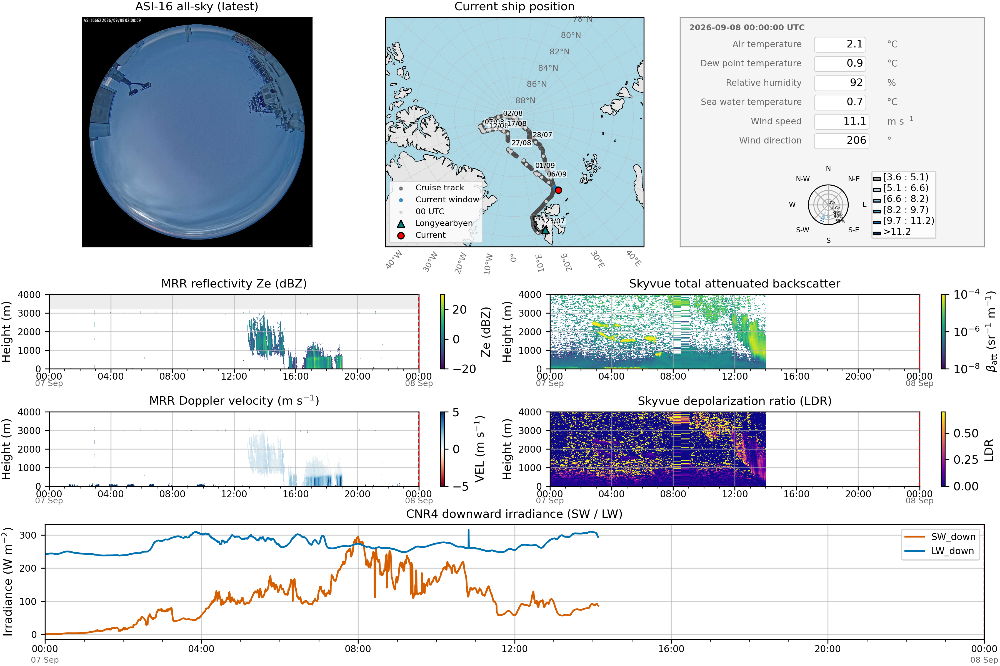

# Archive

Select a date to view the archived quicklook.

```{raw} html
<div>
  <label for="ql-date">Date:</label>
  <select id="ql-date" onchange="updateQuicklook()">
    <option value="20260828">2026-08-28</option>
    <option value="20260829">2026-08-29</option>
    <option value="20260830">2026-08-30</option>
    <option value="20260831">2026-08-31</option>
    <option value="20260902">2026-09-02</option>
    <option value="20260903">2026-09-03</option>
    <option value="20260904">2026-09-04</option>
    <option value="20260905">2026-09-05</option>
    <option value="20260906">2026-09-06</option>
    <option value="20260907" selected>2026-09-07</option>
  </select>
</div>

<div style="margin-top: 1em;">
  
</div>

<script>
function updateQuicklook() {
  const select = document.getElementById('ql-date');
  const dateVal = select.value; // YYYYMMDD
  const img = document.getElementById('ql-image');
  img.src = 'quicklooks/archive/' + dateVal + '_skypallet_quicklook.png';
}
</script>
```
